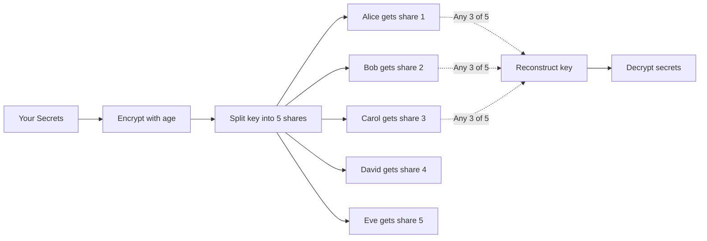
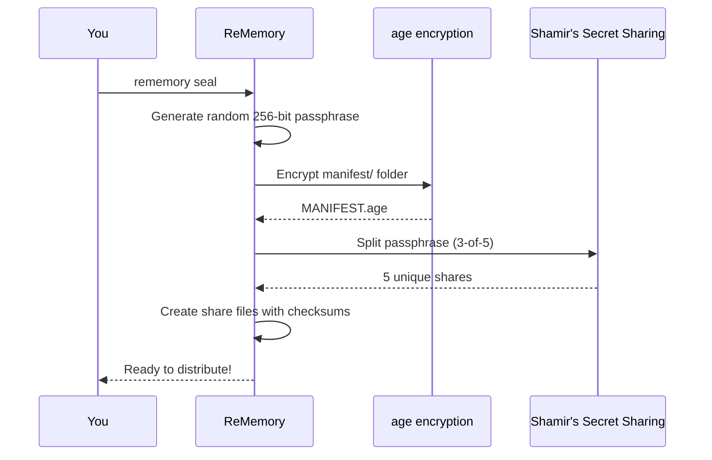
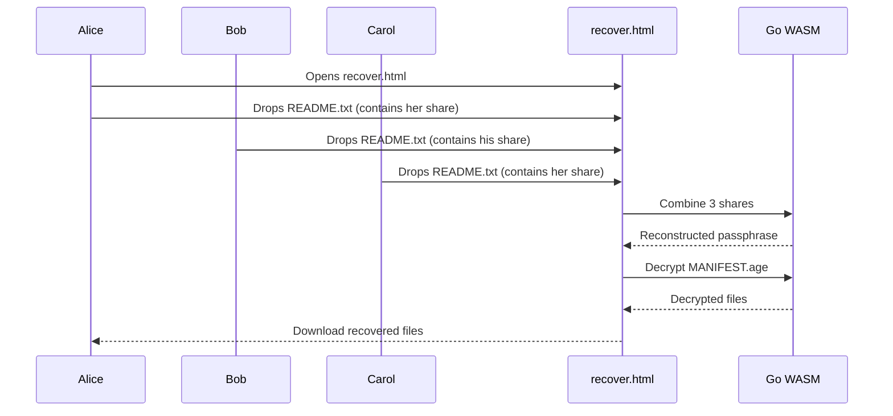
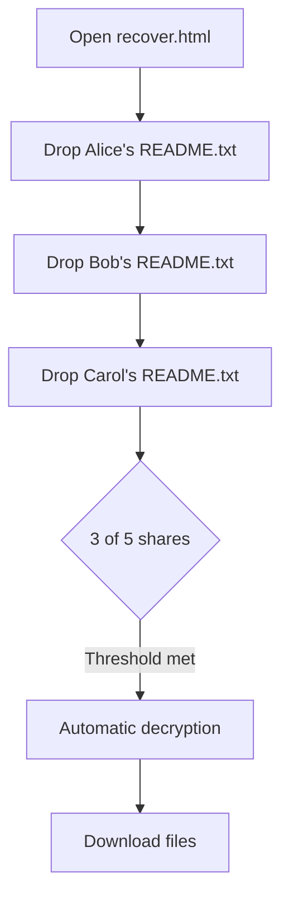

# ReMemory

**Encrypt your secrets. Split the key among friends. Recover when needed.**

ReMemory helps you create a secure "dead man's switch" for your digital secrets. It encrypts sensitive files and splits the decryption key among trusted friends using Shamir's Secret Sharing. No single person can access your secrets alone—but when the time comes, a group of your friends can work together to recover everything.

## Why ReMemory?

We all have digital secrets that matter: password manager recovery codes, cryptocurrency seeds, important documents, or instructions for loved ones. What happens to these if you're suddenly unavailable?

ReMemory solves this with cryptographic guarantees:

- **No single point of failure** — Your secrets require multiple friends to cooperate
- **No trust in any one person** — Even your most trusted friend can't access secrets alone
- **Offline and self-contained** — Recovery works without internet, servers, or ReMemory itself
- **Human-friendly** — Friends receive clear instructions, not cryptographic puzzles



## How It Works

### The Seal Process

When you run `rememory seal`, the following happens:



### The Recovery Process

When your friends need to recover your secrets:



## Installation

### From Source

```bash
git clone https://github.com/eljojo/rememory
cd rememory
make build
./rememory --version
```

### From GitHub Releases

Download the latest binary for your platform from [Releases](https://github.com/eljojo/rememory/releases).

## Quick Start

### 1. Create a Project

```bash
rememory init my-recovery-2026
cd my-recovery-2026
```

You'll be prompted to enter your friends' names and contact information:

```
How many friends will hold shares? [5]: 5
How many shares needed to recover? [3]: 3

Friend 1:
  Name: Alice
  Email: alice@example.com
  Phone (optional): 555-1234

Friend 2:
  Name: Bob
  ...
```

### 2. Add Your Secrets

Place sensitive files in the `manifest/` directory:

```bash
cp ~/Documents/recovery-codes.txt manifest/
cp ~/Documents/crypto-seeds.txt manifest/
echo "The safe combination is 12-34-56" > manifest/notes.txt
```

### 3. Seal the Project

```bash
rememory seal
```

This encrypts your manifest and creates shares for each friend:

```
Encrypting manifest...
  ✓ Created MANIFEST.age (2.3 KB)

Splitting passphrase (3 of 5)...
  ✓ Share for Alice: SHARE-alice.txt
  ✓ Share for Bob: SHARE-bob.txt
  ✓ Share for Carol: SHARE-carol.txt
  ✓ Share for David: SHARE-david.txt
  ✓ Share for Eve: SHARE-eve.txt

Verifying recovery...
  ✓ Successfully verified with shares: Alice, Bob, Carol

Sealed! Run 'rememory bundle' to create distribution packages.
```

### 4. Create Distribution Bundles

```bash
rememory bundle
```

This creates a self-contained ZIP for each friend:

```
my-recovery-2026/output/bundles/
├── bundle-alice.zip  (5.4 MB)
├── bundle-bob.zip    (5.4 MB)
├── bundle-carol.zip  (5.4 MB)
├── bundle-david.zip  (5.4 MB)
└── bundle-eve.zip    (5.4 MB)
```

### 5. Distribute to Friends

Send each friend their bundle. Each bundle contains:

| File | Purpose |
|------|---------|
| `README.txt` | Instructions + their share + contacts |
| `MANIFEST.age` | Your encrypted secrets |
| `recover.html` | Browser-based recovery tool |

**Important:** Tell your friends to keep their bundle safe and private!

## Bundle Contents

Each friend receives a README.txt that contains everything they need:

```
================================================================================
                          REMEMORY RECOVERY BUNDLE
                              For: Alice
================================================================================

⚠️  CONFIDENTIAL - DO NOT SHARE THIS FILE
    This document contains your secret share. Keep it safe.

--------------------------------------------------------------------------------
WHAT IS THIS?
--------------------------------------------------------------------------------
This bundle allows you to help recover encrypted secrets.
You are one of 5 trusted friends who hold pieces of the recovery key.
At least 3 of you must cooperate to decrypt the contents.

--------------------------------------------------------------------------------
HOW TO RECOVER (PRIMARY METHOD - Browser)
--------------------------------------------------------------------------------
1. Open recover.html in any modern browser
2. Drag and drop this README.txt file
3. Collect shares from other friends (they drag their README.txt too)
4. Once you have enough shares, the tool will decrypt automatically
5. Download the recovered files

Works completely offline - no internet required!

--------------------------------------------------------------------------------
YOUR SHARE
--------------------------------------------------------------------------------
-----BEGIN REMEMORY SHARE-----
Version: 1
Index: 1
Total: 5
Threshold: 3
Holder: Alice
...
-----END REMEMORY SHARE-----

--------------------------------------------------------------------------------
OTHER SHARE HOLDERS
--------------------------------------------------------------------------------
Bob - bob@example.com
Carol - carol@example.com
David - david@example.com
Eve - eve@example.com
```

## Recovery

When the time comes, your friends can recover your secrets in two ways:

### Browser Recovery (Recommended)

1. Any friend opens `recover.html` from their bundle
2. They drag & drop README.txt files from multiple friends
3. Once threshold is met, decryption happens automatically
4. Files can be downloaded directly



### CLI Recovery (Fallback)

If the browser tool doesn't work:

```bash
# Download rememory from GitHub releases
rememory recover \
  --shares alice-readme.txt,bob-readme.txt,carol-readme.txt \
  --manifest MANIFEST.age \
  --output recovered/
```

## Project Structure

```
my-recovery-2026/
├── project.yml           # Configuration (friends, threshold)
├── manifest/             # Your secret files (ADD FILES HERE)
│   ├── README.md
│   └── ... your files ...
└── output/
    ├── MANIFEST.age      # Encrypted archive
    ├── shares/           # Individual share files
    │   ├── SHARE-alice.txt
    │   ├── SHARE-bob.txt
    │   └── ...
    └── bundles/          # Distribution packages
        ├── bundle-alice.zip
        ├── bundle-bob.zip
        └── ...
```

## Commands

| Command | Description |
|---------|-------------|
| `rememory init <name>` | Create a new project |
| `rememory seal` | Encrypt manifest and create shares |
| `rememory bundle` | Generate distribution bundles |
| `rememory status` | Show project status |
| `rememory verify` | Verify sealed files integrity |
| `rememory verify-bundle <zip>` | Verify a bundle's integrity |
| `rememory recover` | Recover secrets from shares |

## Security Model

### What ReMemory Protects Against

- **Single point of compromise** — No one person can access secrets
- **Lost shares** — Threshold scheme tolerates some missing shares
- **Tampered shares** — Checksums detect modifications
- **Future software unavailability** — Browser tool is self-contained

### What ReMemory Does NOT Protect Against

- **Collusion** — If threshold friends conspire, they can decrypt
- **All shares lost** — If too many friends lose their shares, recovery fails
- **Coercion** — Friends could be forced to provide shares
- **Malicious friends** — Choose your threshold wisely

### Cryptographic Details

| Component | Algorithm |
|-----------|-----------|
| Encryption | age (scrypt mode) |
| Key derivation | scrypt (N=2^20, r=8, p=1) |
| Secret sharing | Shamir's Secret Sharing over GF(2^8) |
| Checksums | SHA-256 |
| Passphrase | 256 bits from crypto/rand |

## Best Practices

### Choosing Friends

- Pick people who will outlive you or be reachable long-term
- Geographic diversity helps (not all in same disaster zone)
- Mix of tech-savvy and non-tech friends is fine
- Consider their relationship with each other

### Choosing Threshold

| Friends | Recommended Threshold | Notes |
|---------|----------------------|-------|
| 3 | 2 | Minimum setup |
| 5 | 3 | Good balance |
| 7 | 4 | Higher security |

**Rule of thumb:** Threshold should be majority but allow for 1-2 unavailable friends.

### Rotation

Consider creating a new project every 2-3 years:
- Friends' contact info changes
- You may want to update secrets
- Relationships change

Use `rememory init new-project --from old-project` to copy friend configuration.

## Development

```bash
# Build
make build

# Run tests
make test

# Run e2e tests (requires npm install)
npm install
make test-e2e

# Build for all platforms
make build-all
```

## License

MIT

## Credits

Built with:
- [age](https://github.com/FiloSottile/age) — Modern encryption
- [HashiCorp Vault's Shamir implementation](https://github.com/hashicorp/vault) — Secret sharing
- [Cobra](https://github.com/spf13/cobra) — CLI framework
