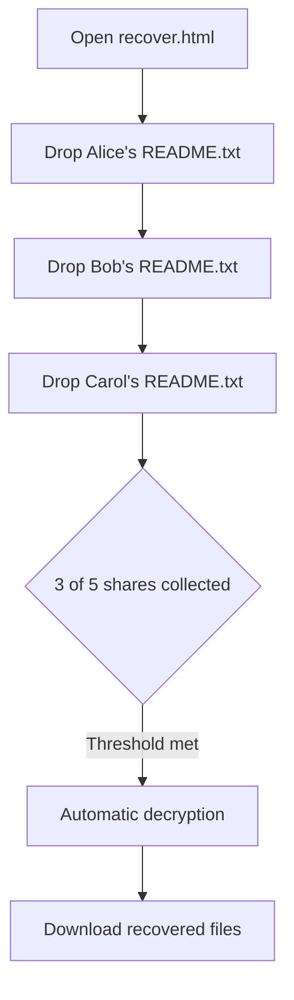
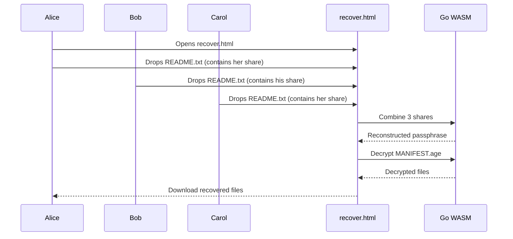
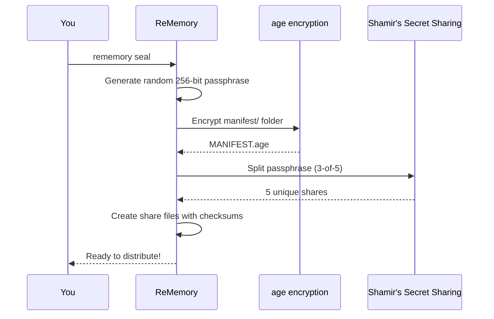
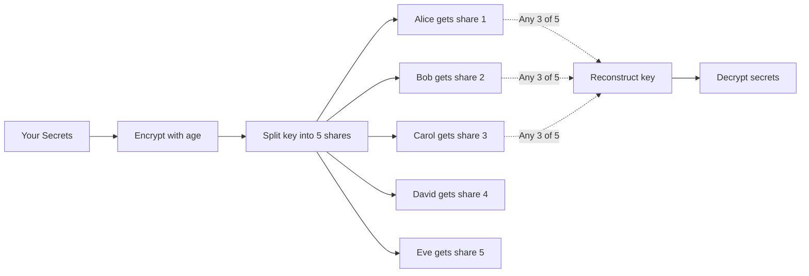

# ReMemory

**A future-proof, human-recoverable, zero-infrastructure cryptographic inheritance protocol.**

ReMemory encrypts your files, splits the decryption key among friends, and gives them a self-contained offline tool to reconstruct it together when needed.

## The Key Innovation

**Recovery works in any browser, fully offline, without ReMemory or the internet.**

Each friend receives a bundle containing `recover.html`—a self-contained recovery tool that runs entirely in their browser. No servers. No dependencies. No need for this project to exist in 20 years.

Your friends can recover your secrets with nothing but a web browser and their bundles. That's it.



## Threat Model

ReMemory assumes:
- Your friends will only cooperate after you're gone (or when needed)
- At least *threshold* friends will keep their bundle safe
- Your computer is trusted at the time you run `seal`
- The browser used for recovery is not compromised at recovery time

ReMemory does NOT rely on:
- Any server or cloud service
- Any ReMemory website or infrastructure
- Any long-term availability of this project
- The internet during recovery

## Cryptographic Guarantees

| Component | Algorithm |
|-----------|-----------|
| Encryption | [age](https://github.com/FiloSottile/age) (scrypt passphrase mode) |
| Key derivation | scrypt (N=2²⁰, r=8, p=1) |
| Secret sharing | Shamir's Secret Sharing over GF(2⁸) |
| Integrity | SHA-256 checksums |
| Passphrase | 256 bits from crypto/rand |

**A single share reveals absolutely nothing about your secret, even to a cryptography expert.** This is a mathematical guarantee of Shamir's Secret Sharing—any fewer than *threshold* shares contains zero information about the original secret.

## Failure Scenarios

| What if... | Result |
|------------|--------|
| A friend loses their bundle? | Fine, as long as threshold friends remain |
| A friend leaks their share publicly? | Harmless without threshold-1 other shares |
| ReMemory disappears in 10 years? | `recover.html` still works—it's self-contained |
| Browsers change dramatically? | `recover.html` is plain HTML + WASM with no external dependencies |
| You forget how this works? | Each bundle's README.txt explains everything |
| Some friends can't be reached? | That's why you set threshold below total friends |

## Why ReMemory?

We all have digital secrets that matter: password manager recovery codes, cryptocurrency seeds, important documents, or instructions for loved ones. What happens to these if you're suddenly unavailable?

Traditional approaches fail:
- **Give one person everything** → Single point of failure and trust
- **Split files manually** → Confusing, error-prone, no encryption
- **Use a password manager's emergency access** → Relies on company existing
- **Write it in a will** → Becomes public record, slow legal process

ReMemory solves this with cryptographic guarantees:

- **No single point of failure** — Your secrets require multiple friends to cooperate
- **No trust in any one person** — Even your most trusted friend can't access secrets alone
- **Offline and self-contained** — Recovery works without internet, servers, or ReMemory itself
- **Designed for non-technical friends to succeed under stress** — Clear instructions, not cryptographic puzzles

## How It Works

### What Your Friends Do (Recovery)

When the time comes, your friends gather and use `recover.html`:



Everything happens locally in the browser. No data leaves their computer.

### What You Do (Sealing)

When you run `rememory seal`:



### How Shamir's Secret Sharing Works



The key insight: any 3 shares can reconstruct the key, but 2 shares reveal nothing. Not "very little"—mathematically zero information.

## Installation

### From GitHub Releases

Download the latest binary for your platform from [Releases](https://github.com/eljojo/rememory/releases).

### From Source

```bash
git clone https://github.com/eljojo/rememory
cd rememory
make build
./rememory --version
```

## Quick Start

### 1. Create a Project

```bash
rememory init my-recovery-2026
cd my-recovery-2026
```

You'll be prompted to enter your friends' names and contact information:

```
How many friends will hold shares? [5]: 5
How many shares needed to recover? [3]: 3

Friend 1:
  Name: Alice
  Email: alice@example.com
  Phone (optional): 555-1234

Friend 2:
  Name: Bob
  ...
```

### 2. Add Your Secrets

Place sensitive files in the `manifest/` directory:

```bash
cp ~/Documents/recovery-codes.txt manifest/
cp ~/Documents/crypto-seeds.txt manifest/
echo "The safe combination is 12-34-56" > manifest/notes.txt
```

### 3. Seal the Project

```bash
rememory seal
```

This encrypts your manifest and creates shares:

```
Encrypting manifest...
  ✓ Created MANIFEST.age (2.3 KB)

Splitting passphrase (3 of 5)...
  ✓ Share for Alice: SHARE-alice.txt
  ✓ Share for Bob: SHARE-bob.txt
  ✓ Share for Carol: SHARE-carol.txt
  ✓ Share for David: SHARE-david.txt
  ✓ Share for Eve: SHARE-eve.txt

Verifying recovery...
  ✓ Successfully verified with shares: Alice, Bob, Carol

Sealed! Run 'rememory bundle' to create distribution packages.
```

### 4. Create Distribution Bundles

```bash
rememory bundle
```

This creates a self-contained ZIP for each friend:

```
output/bundles/
├── bundle-alice.zip  (5.4 MB)
├── bundle-bob.zip    (5.4 MB)
├── bundle-carol.zip  (5.4 MB)
├── bundle-david.zip  (5.4 MB)
└── bundle-eve.zip    (5.4 MB)
```

### 5. Distribute to Friends

Send each friend their bundle. Each bundle contains:

| File | Purpose |
|------|---------|
| `README.txt` | Instructions + their share + contact list |
| `README.pdf` | Same content, formatted for printing |
| `MANIFEST.age` | Your encrypted secrets |
| `recover.html` | Browser-based recovery tool (~5 MB, self-contained) |

**A single share reveals absolutely nothing.** But tell your friends to keep their bundle safe anyway—it's their responsibility to you.

## What Friends Receive

Each friend's README.txt contains everything they need:

```
================================================================================
                          REMEMORY RECOVERY BUNDLE
                              For: Alice
================================================================================

!! YOU CANNOT USE THIS FILE ALONE !!
   You will need help from other friends listed below.

!! CONFIDENTIAL - DO NOT SHARE THIS FILE !!
   This document contains your secret share. Keep it safe.

--------------------------------------------------------------------------------
WHAT IS THIS?
--------------------------------------------------------------------------------
This bundle allows you to help recover encrypted secrets.
You are one of 5 trusted friends who hold pieces of the recovery key.
At least 3 of you must cooperate to decrypt the contents.

--------------------------------------------------------------------------------
HOW TO RECOVER (PRIMARY METHOD - Browser)
--------------------------------------------------------------------------------
1. Open recover.html in any modern browser
2. Drag and drop this README.txt file
3. Collect shares from other friends (they drag their README.txt too)
4. Once you have enough shares, the tool will decrypt automatically
5. Download the recovered files

Works completely offline - no internet required!

--------------------------------------------------------------------------------
YOUR SHARE
--------------------------------------------------------------------------------
-----BEGIN REMEMORY SHARE-----
Version: 1
Index: 1
Total: 5
Threshold: 3
Holder: Alice
...
-----END REMEMORY SHARE-----

--------------------------------------------------------------------------------
OTHER SHARE HOLDERS (contact to coordinate recovery)
--------------------------------------------------------------------------------
Bob - bob@example.com - 555-2345
Carol - carol@example.com
David - david@example.com - 555-4567
Eve - eve@example.com
```

## Verification

You can verify the integrity of any bundle without trusting ReMemory:

```bash
rememory verify-bundle bundle-alice.zip
```

This checks:
- All required files are present
- Checksums match the values in README.txt
- The embedded share is valid and parseable

## Recovery Methods

### Browser Recovery (Recommended)

1. Any friend opens `recover.html` from their bundle
2. Friends drag & drop their README.txt files
3. Once threshold is met, decryption happens automatically
4. Download the recovered files

No installation required. Works on any modern browser. Fully offline.

### CLI Recovery (Fallback)

If the browser tool doesn't work for some reason:

```bash
# Download rememory from GitHub releases
rememory recover \
  --shares alice-readme.txt,bob-readme.txt,carol-readme.txt \
  --manifest MANIFEST.age \
  --output recovered/
```

## Project Structure

```
my-recovery-2026/
├── project.yml           # Configuration (friends, threshold)
├── manifest/             # Your secret files (ADD FILES HERE)
│   ├── README.md
│   └── ... your files ...
└── output/
    ├── MANIFEST.age      # Encrypted archive
    ├── shares/           # Individual share files
    │   ├── SHARE-alice.txt
    │   └── ...
    └── bundles/          # Distribution packages
        ├── bundle-alice.zip
        └── ...
```

## Commands

| Command | Description |
|---------|-------------|
| `rememory init <name>` | Create a new project |
| `rememory seal` | Encrypt manifest and create shares |
| `rememory bundle` | Generate distribution bundles |
| `rememory status` | Show project status |
| `rememory verify-bundle <zip>` | Verify a bundle's integrity |
| `rememory recover` | Recover secrets from shares |

## Best Practices

### Choosing Friends

- Pick people likely to be reachable long-term
- Geographic diversity helps (not all in same disaster zone)
- Mix of tech-savvy and non-tech friends is fine—the tool is designed for everyone
- Consider their relationships with each other (will they cooperate?)

### Choosing Threshold

| Friends | Recommended Threshold | Notes |
|---------|----------------------|-------|
| 3 | 2 | Minimum viable setup |
| 5 | 3 | Good balance of security and availability |
| 7 | 4-5 | Higher security, requires more coordination |

**Rule of thumb:** Set threshold high enough that casual collusion is unlikely, but low enough that recovery is possible if 1-2 friends are unavailable.

### Rotation

Consider creating a new project every 2-3 years:
- Friends' contact info changes
- You may want to update secrets
- Relationships change
- New cryptographic best practices emerge

Use `rememory init new-project --from old-project` to copy friend configuration.

## Development

```bash
make build        # Build binary
make test         # Run unit tests
make test-e2e     # Run browser tests (requires: npm install)
make build-all    # Cross-compile for all platforms
```

## License

MIT

## Credits

ReMemory implements a protocol built on:
- [age](https://github.com/FiloSottile/age) — Modern file encryption by Filippo Valsorda
- [HashiCorp Vault's Shamir implementation](https://github.com/hashicorp/vault) — Battle-tested secret sharing
- [Cobra](https://github.com/spf13/cobra) — CLI framework
